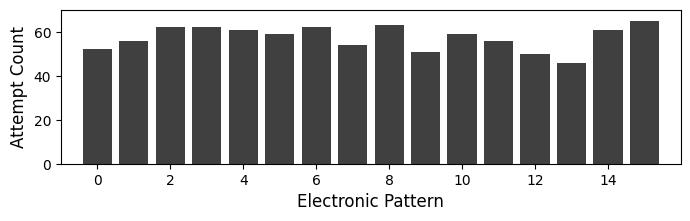
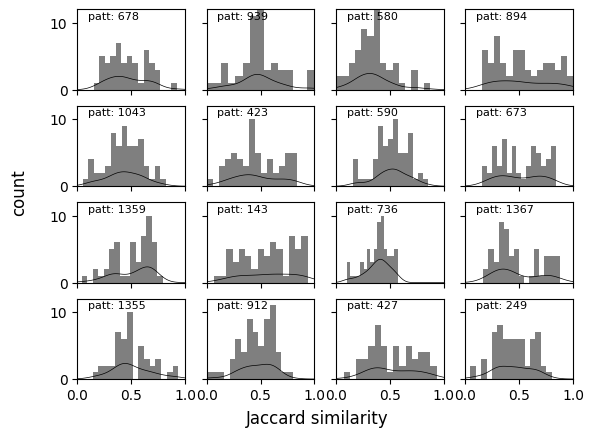
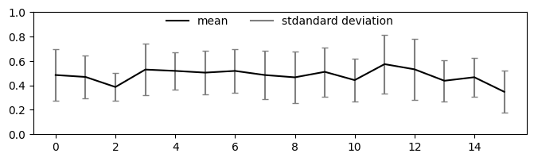

This site is dedicated to the ANON Dataset, a crowd-sourced expressive symbolic dataset consisting of 6,035 improvised tapped sequences performed by 3,184 participants with varying levels of musical expertise. Each sample contains expressive timing and dynamics information and is annotated with the participant’s self-reported level of musical expertise, the genre of the selected pattern, the chosen tempo, the total duration to complete the activity, and a user-rating for their performance and how much they enjoyed the exhibit. The drum patterns from our in-house collection are available as text files containing the tempo and each note onset in the following format: MIDI note number, start time (seconds), start time (quarter notes). 

  <!-- Add vertical space here -->

## **Listen to the Collected Samples**

---
- [Subset 01: _Bongo Improvisations along with **Afrobeat** Drum Patterns_]({{site.baseurl}}/explore/afrobeat/)
- [Subset 02: _Bongo Improvisations along with **Afrocuban** Drum Patterns_]({{site.baseurl}}/explore/afrocuban/)
- [Subset 03: _Bongo Improvisations along with **Bossanova** Drum Patterns_]({{site.baseurl}}/explore/bossanova/)
- [Subset 04: _Bongo Improvisations along with **Disco** Drum Patterns_]({{site.baseurl}}/explore/disco/)
- [Subset 05: _Bongo Improvisations along with **Electronic** Drum Patterns_]({{site.baseurl}}/explore/electronic/)
- [Subset 06: _Bongo Improvisations along with **Funk** Drum Patterns_]({{site.baseurl}}/explore/funk/)
- [Subset 07: _Bongo Improvisations along with **Hip-hop** Drum Patterns_]({{site.baseurl}}/explore/hip-hop/)
- [Subset 08: _Bongo Improvisations along with **Jazz** Drum Patterns_]({{site.baseurl}}/explore/jazz/)
- [Subset 09: _Bongo Improvisations along with **Rock** Drum Patterns_]({{site.baseurl}}/explore/rock/)
- [Subset 10: _Bongo Improvisations along with **Soul** Drum Patterns_]({{site.baseurl}}/explore/soul/)

  <!-- Add vertical space here -->

## **Dataset Analysis**
---
### The images below display some preliminary analysis of the entire dataset.
  <!-- Add vertical space here -->
  <!-- Add vertical space here -->

<figcaption>Number of total attempts by level of expertise.</figcaption>

  <!-- Add vertical space here -->
  <!-- Add vertical space here -->

<figcaption>Number of attempts per session by level of expertise.</figcaption>

  <!-- Add vertical space here -->
  <!-- Add vertical space here -->

<figcaption>Number of total attempts by genre and level of expertise.</figcaption>

  <!-- Add vertical space here -->
  <!-- Add vertical space here -->

<figcaption>Number of total attempts by genre.</figcaption>

  <!-- Add vertical space here -->
  <!-- Add vertical space here -->

<figcaption>Jaccard similarity among all improvisations for different musical levels and pattern.</figcaption>

  <!-- Add vertical space here -->
  <!-- Add vertical space here -->

<figcaption>Onset density and metrical weight per step of drum patterns and improvisations.</figcaption>

  <!-- Add vertical space here -->
  <!-- Add vertical space here -->

<figcaption>Number of unique patterns tested by genre and musical expertise.</figcaption>

  <!-- Add vertical space here -->
  <!-- Add vertical space here -->

## **Electronic Genre Analysis**

The images below show preliminary analysis of the improvisations performed alongside the 16 Electronic patterns.
---
  <!-- Add vertical space here -->
  <!-- Add vertical space here -->

<figcaption>Number of attempts per each Electronic pattern.</figcaption>

  <!-- Add vertical space here -->

<figcaption>Jaccard similarities by each Electronic pattern and level of musical expertise</figcaption>

  <!-- Add vertical space here -->

<figcaption>Distributions of Jaccard similarities for each Electronic pattern.</figcaption>

  <!-- Add vertical space here -->

<figcaption>Jaccard similarity means and standard deviation for every pattern in the Electronic music genre.</figcaption>

  <!-- Add vertical space here -->
